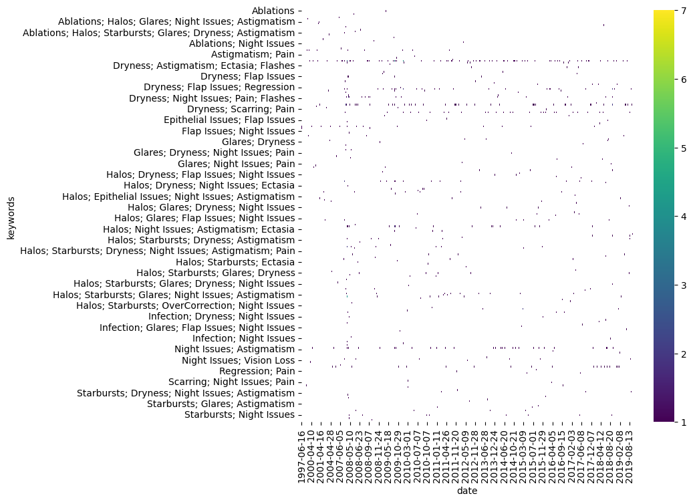
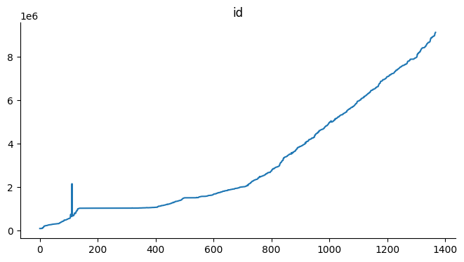
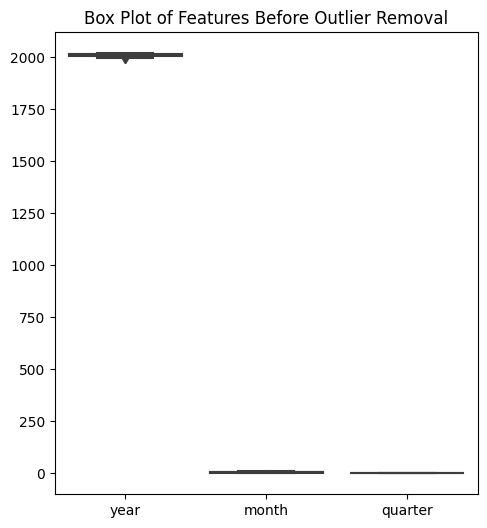
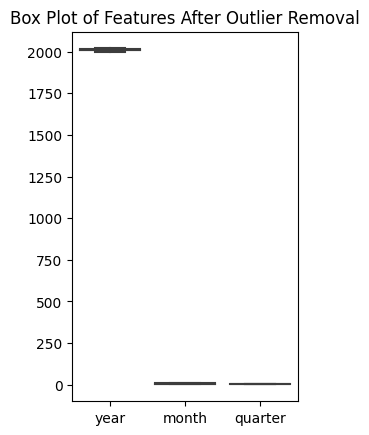
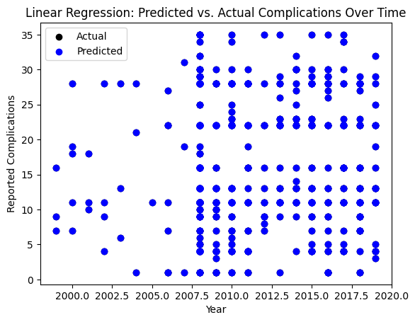

# Temporal Analysis of Lasik Complications: A Data Exploration and Regression Modeling Approach

**Introduction**

Welcome to the Lasik (Laser Eye Surgery) Complication Analysis project. This exploration delves into understanding reported complications associated with Lasik procedures by leveraging a comprehensive dataset. The primary objective is to analyze the relationship between reported complications and time, examining trends and potential factors influencing these occurrences.

Throughout this project, I employ data analysis techniques, visualization, and machine learning to gain insights into the Lasik complications dataset. Starting with data loading and exploration, we move through preprocessing steps, feature engineering, and the application of a Linear Regression model. The evaluation metrics offer a quantitative assessment of the model's performance, guiding us in understanding its ability to predict reported complications accurately.

Join Me on this data-driven journey as I uncover patterns, address challenges, and set the stage for future enhancements to improve the model's effectiveness.

## Dataset
The dataset focuses on complications reported by patients who underwent Laser Eye Surgeries, particularly Lasik procedures. It spans from June 1997 to April 2019 and is sourced from FDA Public Reports. Each entry in the dataset includes a unique ID, date of the report, complication report text, and keywords associated with the report.

The dataset reveals a variety of complications experienced by patients, including issues with corneal flaps, laser treatments, astigmatism, and others. There are reports of non-approved laser usage, changes in vision, eye damage, and issues related to the excimer laser. The dataset provides a detailed account of patients' experiences post-Lasik surgery.

Potential applications of the dataset include identifying key complications, entities, and topics over time using Natural Language Processing (NLP). The dataset is well-documented, maintained, and offers opportunities for learning, research, and application in the field of healthcare. It comes with a Public Domain license (CC0) and is expected to be updated annually.

***Dataset Link:*** [Lasik (Laser Eye Surgery) Complications](https://www.kaggle.com/datasets/shivamb/lasik-complications-dataset)
## Porject Overview

 **Imported Libraries:**
   - Imported essential Python libraries such as pandas, numpy, matplotlib, seaborn, scipy, and scikit-learn to facilitate data manipulation, analysis, and machine learning.
`import pandas as pd`

`import numpy as np`

`import matplotlib.pyplot as plt`

`import seaborn as sns`

`from scipy import stats`

`from sklearn.model_selection import train_test_split`

`from sklearn.linear_model import LinearRegression`

`from sklearn.metrics import mean_squared_error, r2_score`

`from sklearn.preprocessing import LabelEncoder`

 **Loading and Exploring the Dataset:**
   - Loaded the Lasik complications dataset from a GitHub repository and provided basic information about the dataset, including data types and non-null counts.
   - Displayed the first few rows of the dataset to get a glimpse of the data structure.

 **Distribution Graph of the Dataset:**
   - Created a distribution graph using a heatmap to visualize the frequency of reported complications over time.

 **Preprocessing the Data:**
 - Checked for missing values in the dataset and dropped rows with missing values.
 - Converted the 'date' column to datetime format.

**Label Encoding:**

 - Applied label encoding to the 'keywords' column.
 - Split the 'keywords' into separate rows and exploded the dataframe.

 **Before Checking and Removing Outlier:**
   - Visualized the box plot of features before outlier removal, providing an initial understanding of the data distribution.

 **After Checking and Removing Outliers:**
   - Employed z-scores to identify and remove outliers from the dataset.
   - Visualized the box plot after outlier removal to observe the impact on data distribution.

 **Feature Engineering:**
   - Extracted year, month, and quarter from the 'date' column to enhance the dataset with additional temporal features.

 **Choosing Features and Target Variable:**
   - Selected 'year', 'month', and 'quarter' as features and 'keywords' as the target variable for further analysis.

 **Train the Linear Regression Model:**
   - Created a Linear Regression model and trained it using the selected features and target variable.

 **Evaluate the Model:**
    - Utilized Mean Squared Error (MSE) and R-squared (R²) score metrics to evaluate the performance of the trained Linear Regression model on the test set.
`Mean Squared Error: 6.46409103106912e-30`

`R^2 Score: 1.0`

 **Visualize the Results:**
    - Visualized the predicted complications versus actual complications over time using a scatter plot, providing a qualitative assessment of the model's performance.

## About the Author

- 
- 
- 
- 

